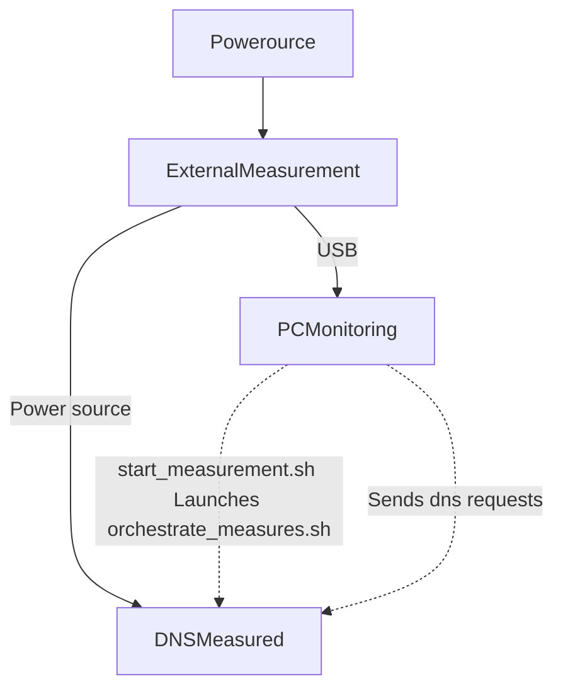

# dns-activity-monitoring
Tools for analysing DNS activity such as request received and energy consumption in order to analyze those.

```mermaid
graph TD;
    Powerource --> ExternalMeasurement;
    ExternalMeasurement --> |Power source| DNSMeasured;
    ExternalMeasurement --> |USB| PCMonitoring;
    PCMonitoring -.-> |start_measurement.sh Launches orchestrate_measures.sh| DNSMeasured;
    PCMonitoring -..-> |Sends dns requests| DNSMeasured
```