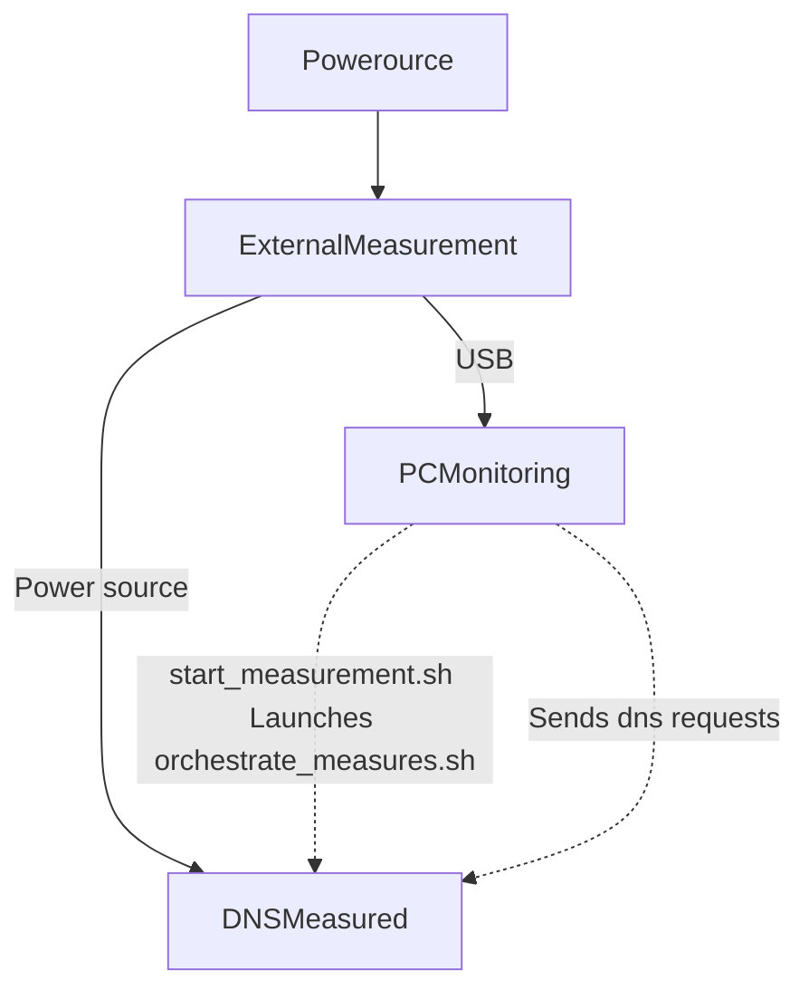

# dns-activity-monitoring
Tools for analysing DNS activity such as request received and energy consumption in order to analyze those.

## TODO

Fix the `bind_query_capture.sh` sleep time which is independant of the time elapsed during the capture.
-> This creates a notable difference in the time duration of the script (finishes after all other ones).
Same for multiple measurement scripts

Time synchronisation to implement on start scripts